```python
import pandas as pd
import numpy as np
```


```python
df = pd.read_csv('laptop_data.csv')
```


```python
df.sample(5)
```


<div>
<style scoped>
    .dataframe tbody tr th:only-of-type {
        vertical-align: middle;
    }

    .dataframe tbody tr th {
        vertical-align: top;
    }

    .dataframe thead th {
        text-align: right;
    }
</style>
<table border="1" class="dataframe">
  <thead>
    <tr style="text-align: right;">
      <th></th>
      <th>Unnamed: 0</th>
      <th>Company</th>
      <th>TypeName</th>
      <th>Inches</th>
      <th>ScreenResolution</th>
      <th>Cpu</th>
      <th>Ram</th>
      <th>Memory</th>
      <th>Gpu</th>
      <th>OpSys</th>
      <th>Weight</th>
      <th>Price</th>
    </tr>
  </thead>
  <tbody>
    <tr>
      <th>781</th>
      <td>781</td>
      <td>Asus</td>
      <td>Gaming</td>
      <td>17.3</td>
      <td>IPS Panel Full HD 1920x1080</td>
      <td>Intel Core i7 6700HQ 2.6GHz</td>
      <td>16GB</td>
      <td>256GB SSD +  1TB HDD</td>
      <td>Nvidia GeForce GTX 1070</td>
      <td>Windows 10</td>
      <td>4.3kg</td>
      <td>125208.0000</td>
    </tr>
    <tr>
      <th>1139</th>
      <td>1139</td>
      <td>HP</td>
      <td>Ultrabook</td>
      <td>15.6</td>
      <td>Full HD 1920x1080</td>
      <td>Intel Core i7 6500U 2.5GHz</td>
      <td>8GB</td>
      <td>256GB SSD</td>
      <td>Intel HD Graphics 520</td>
      <td>Windows 7</td>
      <td>1.88kg</td>
      <td>115709.2416</td>
    </tr>
    <tr>
      <th>734</th>
      <td>734</td>
      <td>Lenovo</td>
      <td>Notebook</td>
      <td>13.3</td>
      <td>IPS Panel Full HD 1920x1080</td>
      <td>Intel Core i5 7200U 2.5GHz</td>
      <td>8GB</td>
      <td>256GB SSD</td>
      <td>Intel HD Graphics 620</td>
      <td>Windows 10</td>
      <td>1.44kg</td>
      <td>51148.8000</td>
    </tr>
    <tr>
      <th>842</th>
      <td>842</td>
      <td>HP</td>
      <td>Notebook</td>
      <td>17.3</td>
      <td>1600x900</td>
      <td>Intel Core i5 7200U 2.5GHz</td>
      <td>8GB</td>
      <td>1TB HDD</td>
      <td>Nvidia GeForce 930MX</td>
      <td>Windows 10</td>
      <td>2.63kg</td>
      <td>48484.8000</td>
    </tr>
    <tr>
      <th>1062</th>
      <td>1062</td>
      <td>Dell</td>
      <td>Notebook</td>
      <td>15.6</td>
      <td>Full HD 1920x1080</td>
      <td>Intel Core i5 7200U 2.5GHz</td>
      <td>4GB</td>
      <td>1TB HDD</td>
      <td>Intel HD Graphics</td>
      <td>Windows 10</td>
      <td>2.25kg</td>
      <td>29783.5200</td>
    </tr>
  </tbody>
</table>
</div>


***
  1. Data cleaning
  2. EDA
  4. Model building
  5. Evaluation
  6. Improvement
  7. Website
  8. Deploy
***


> ### ***Data Cleaning***


```python
df.info()
```

    <class 'pandas.core.frame.DataFrame'>
    RangeIndex: 1303 entries, 0 to 1302
    Data columns (total 12 columns):
     #   Column            Non-Null Count  Dtype  
    ---  ------            --------------  -----  
     0   Unnamed: 0        1303 non-null   int64  
     1   Company           1303 non-null   object 
     2   TypeName          1303 non-null   object 
     3   Inches            1303 non-null   float64
     4   ScreenResolution  1303 non-null   object 
     5   Cpu               1303 non-null   object 
     6   Ram               1303 non-null   object 
     7   Memory            1303 non-null   object 
     8   Gpu               1303 non-null   object 
     9   OpSys             1303 non-null   object 
     10  Weight            1303 non-null   object 
     11  Price             1303 non-null   float64
    dtypes: float64(2), int64(1), object(9)
    memory usage: 122.3+ KB
    


```python
df.duplicated().sum()
```


    0


```python
df.isnull().sum()
```


    Unnamed: 0          0
    Company             0
    TypeName            0
    Inches              0
    ScreenResolution    0
    Cpu                 0
    Ram                 0
    Memory              0
    Gpu                 0
    OpSys               0
    Weight              0
    Price               0
    dtype: int64


```python
df.drop(columns=['Unnamed: 0'],inplace=True)
```


```python
df['Ram'] = df['Ram'].str.replace('GB','') #Removing 'GB' from Ram 
df['Weight'] = df['Weight'].str.replace('kg','') #Removing 'Kg' from Weight 
```


```python
df[['Ram','Weight']] = df[['Ram','Weight']].astype('float32')
```


```python
df.info()
```

    <class 'pandas.core.frame.DataFrame'>
    RangeIndex: 1303 entries, 0 to 1302
    Data columns (total 11 columns):
     #   Column            Non-Null Count  Dtype  
    ---  ------            --------------  -----  
     0   Company           1303 non-null   object 
     1   TypeName          1303 non-null   object 
     2   Inches            1303 non-null   float64
     3   ScreenResolution  1303 non-null   object 
     4   Cpu               1303 non-null   object 
     5   Ram               1303 non-null   float32
     6   Memory            1303 non-null   object 
     7   Gpu               1303 non-null   object 
     8   OpSys             1303 non-null   object 
     9   Weight            1303 non-null   float32
     10  Price             1303 non-null   float64
    dtypes: float32(2), float64(2), object(7)
    memory usage: 101.9+ KB
    

>## ***EDA & Data Preprocessing***


```python
import seaborn as sns
import matplotlib.pyplot as plt
```


```python
sns.displot(df['Price'],kde=True)  # we can see data is skewed 
```


    <seaborn.axisgrid.FacetGrid at 0x1fba2876bb0>


    
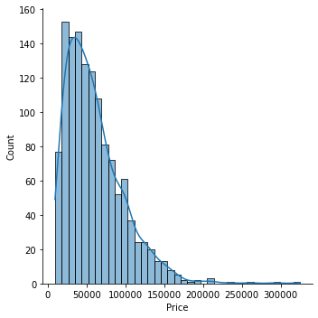
    


```python
df['Company'].value_counts().plot(kind='bar')
```


    <AxesSubplot:>


    
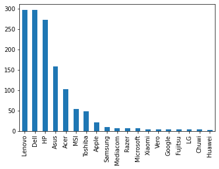
    


```python
sns.barplot(x=df['Company'],y=df['Price'])
plt.xticks(rotation='vertical')
plt.show()
```


    
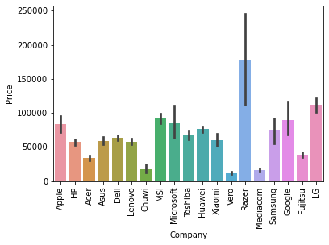
    


```python
df['TypeName'].value_counts().plot(kind='bar')
```


    <AxesSubplot:>


    
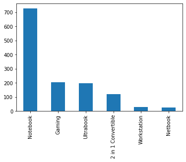
    


```python
sns.barplot(x=df['TypeName'],y=df['Price'])
plt.xticks(rotation='vertical')
plt.show()
```


    
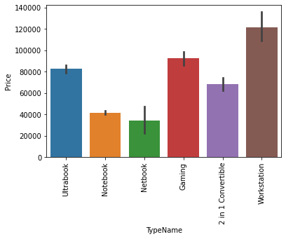
    


```python
sns.barplot(x=df['Inches'],y=df['Price'])
plt.xticks(rotation='vertical')
plt.show()
```


    
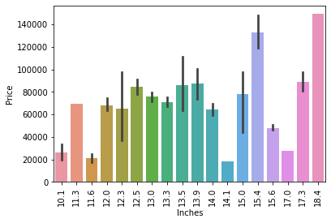
    


```python
df['ScreenResolution'].value_counts()
```


    Full HD 1920x1080                                507
    1366x768                                         281
    IPS Panel Full HD 1920x1080                      230
    IPS Panel Full HD / Touchscreen 1920x1080         53
    Full HD / Touchscreen 1920x1080                   47
    1600x900                                          23
    Touchscreen 1366x768                              16
    Quad HD+ / Touchscreen 3200x1800                  15
    IPS Panel 4K Ultra HD 3840x2160                   12
    IPS Panel 4K Ultra HD / Touchscreen 3840x2160     11
    4K Ultra HD / Touchscreen 3840x2160               10
    IPS Panel 1366x768                                 7
    Touchscreen 2560x1440                              7
    4K Ultra HD 3840x2160                              7
    Touchscreen 2256x1504                              6
    IPS Panel Quad HD+ / Touchscreen 3200x1800         6
    IPS Panel Retina Display 2560x1600                 6
    IPS Panel Retina Display 2304x1440                 6
    IPS Panel Touchscreen 2560x1440                    5
    IPS Panel Retina Display 2880x1800                 4
    IPS Panel Touchscreen 1920x1200                    4
    IPS Panel 2560x1440                                4
    1440x900                                           4
    Touchscreen 2400x1600                              3
    2560x1440                                          3
    Quad HD+ 3200x1800                                 3
    IPS Panel Quad HD+ 2560x1440                       3
    IPS Panel Touchscreen 1366x768                     3
    1920x1080                                          3
    IPS Panel Full HD 2160x1440                        2
    IPS Panel Touchscreen / 4K Ultra HD 3840x2160      2
    IPS Panel Quad HD+ 3200x1800                       2
    IPS Panel Touchscreen 2400x1600                    1
    Touchscreen / 4K Ultra HD 3840x2160                1
    Touchscreen / Quad HD+ 3200x1800                   1
    IPS Panel Retina Display 2736x1824                 1
    Touchscreen / Full HD 1920x1080                    1
    IPS Panel Full HD 1920x1200                        1
    IPS Panel Full HD 1366x768                         1
    IPS Panel Full HD 2560x1440                        1
    Name: ScreenResolution, dtype: int64


```python
# Extracting information from ScreenResolution
```


```python
df['Touch'] = df['ScreenResolution'].apply(lambda x: 1 if 'Touchscreen' in x else 0)
```


```python
df['Ips'] = df['ScreenResolution'].apply(lambda x: 1 if 'IPS' in x else 0)
```


```python
sns.barplot(x=df['Touch'],y=df['Price']) # Touch Screen are priced higher
```


    <AxesSubplot:xlabel='Touch', ylabel='Price'>


    
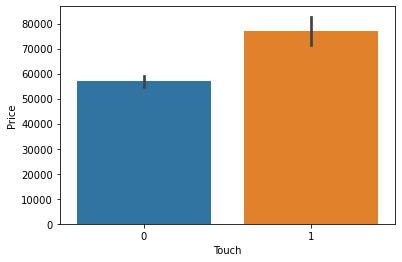
    


```python
sns.barplot(x=df['Ips'],y=df['Price']) # Ips screen are priced higher
```


    <AxesSubplot:xlabel='Ips', ylabel='Price'>


    
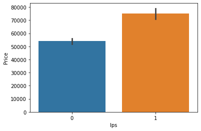
    


```python
new = df['ScreenResolution'].str.split('x',expand=True)
```


```python
df['x'] = new[0].apply(lambda x : x[-4:])
```


```python
df['y'] =new[1]
```


```python
df[['x','y']]=df[['x','y']].astype(int)
```


```python
# Combinig x,y,inches in one column
```


```python
df['ppi']=(((df['x']**2)+(df['y']**2))**0.5/df['Inches']).astype(float)
```


```python
df.corr()['Price'].sort_values()
```


    Inches    0.068197
    Touch     0.191226
    Weight    0.210370
    Ips       0.252208
    ppi       0.473487
    y         0.552809
    x         0.556529
    Ram       0.743007
    Price     1.000000
    Name: Price, dtype: float64


```python
df.drop(columns=['ScreenResolution','x','y','Inches'],inplace=True)
```


```python
# Extracting data from cpu column
```


```python
df['Cpu']=df['Cpu'].apply(lambda x:" ".join(x.split()[0:3]))
```


```python
def fetch_processor(text):
    if (text == 'Intel Core i7') or (text == 'Intel Core i5') or (text == 'Intel Core i3'):
        return text
    else:
        if text.split()[0]=='Intel':
            return 'Old Intel Processor'
        else:
            return 'AMD Processor'
```


```python
df['Cpu']=df['Cpu'].apply(fetch_processor)
```


```python
sns.barplot(x=df['Cpu'],y=df['Price'])
```


    <AxesSubplot:xlabel='Cpu', ylabel='Price'>


    
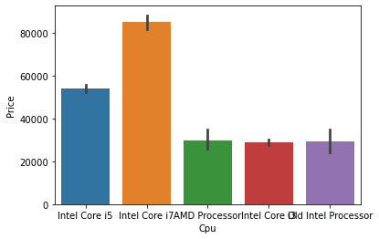
    


```python
# Extracting data from Gpu
```


```python
# Removing GB or TB from data
df['Memory'] = df['Memory'].astype(str).replace('\.0', '', regex=True)
df["Memory"] = df["Memory"].str.replace('GB', '')
df["Memory"] = df["Memory"].str.replace('TB', '000')
```


```python
# Splitting Coulmn into two parts
new = df["Memory"].str.split("+", n = 1, expand = True)
df['first'] = new[0].str.strip()
df['second'] = new[1].str.strip()
df["second"].fillna("0", inplace = True)
```


```python
df["Layer1HDD"] = df["first"].apply(lambda x: 1 if "HDD" in x else 0)
df["Layer1SSD"] = df["first"].apply(lambda x: 1 if "SSD" in x else 0)
df["Layer1Hybrid"] = df["first"].apply(lambda x: 1 if "Hybrid" in x else 0)
df["Layer1Flash_Storage"] = df["first"].apply(lambda x: 1 if "Flash Storage" in x else 0)
```


```python
df["Layer2HDD"] = df["second"].apply(lambda x: 1 if "HDD" in x else 0)
df["Layer2SSD"] = df["second"].apply(lambda x: 1 if "SSD" in x else 0)
df["Layer2Hybrid"] = df["second"].apply(lambda x: 1 if "Hybrid" in x else 0)
df["Layer2Flash_Storage"] = df["second"].apply(lambda x: 1 if "Flash Storage" in x else 0)
```


```python
df['first'] = df['first'].str.replace(r'\D', '',regex=True)
df['second'] = df['second'].str.replace(r'\D', '',regex=True)
```


```python
df["first"] = df["first"].astype(int)
df["second"] = df["second"].astype(int)
```


```python
df["HDD"]=(df["first"]*df["Layer1HDD"]+df["second"]*df["Layer2HDD"])
df["SSD"]=(df["first"]*df["Layer1SSD"]+df["second"]*df["Layer2SSD"])
df["Hybrid"]=(df["first"]*df["Layer1Hybrid"]+df["second"]*df["Layer2Hybrid"])
df["Flash_Storage"]=(df["first"]*df["Layer1Flash_Storage"]+df["second"]*df["Layer2Flash_Storage"])
```


```python
df.drop(columns=['first', 'second', 'Layer1HDD', 'Layer1SSD', 'Layer1Hybrid',
       'Layer1Flash_Storage', 'Layer2HDD', 'Layer2SSD', 'Layer2Hybrid',
       'Layer2Flash_Storage'],inplace=True)
```


```python
# Dropping Column Memory after extracting data
```


```python
df.drop(columns=['Memory'],inplace=True)
```


```python
df.corr()['Price'].sort_values(ascending=False)
```


    Price            1.000000
    Ram              0.743007
    SSD              0.670799
    ppi              0.473487
    Ips              0.252208
    Weight           0.210370
    Touch            0.191226
    Hybrid           0.007989
    Flash_Storage   -0.040511
    HDD             -0.096441
    Name: Price, dtype: float64


```python
# we can drop Hybrid Flash_Storage HDD since there is no correlation
```


```python
df.drop(columns=['Hybrid','Flash_Storage','HDD'],inplace=True)
```


```python
# Extracting data from GPU Column
```


```python
df['Gpu'] = df['Gpu'].apply(lambda x : x.split()[0])
```


```python
df['Gpu'].value_counts()
```


    Intel     722
    Nvidia    400
    AMD       180
    ARM         1
    Name: Gpu, dtype: int64


```python
df = df[df['Gpu']!='ARM']
```


```python
df['Gpu'].value_counts()
```


    Intel     722
    Nvidia    400
    AMD       180
    Name: Gpu, dtype: int64


```python
# Extracting data from OpSys Column
```


```python
df['OpSys'].value_counts()
```


    Windows 10      1072
    No OS             66
    Linux             62
    Windows 7         45
    Chrome OS         26
    macOS             13
    Windows 10 S       8
    Mac OS X           8
    Android            2
    Name: OpSys, dtype: int64


```python
df['OpSys']=df['OpSys'].apply(lambda x: 'Windows' if 'Windows' in x else x)
df['OpSys']=df['OpSys'].apply(lambda x: 'Mac' if ('Mac' in x) or ('macOS'in x) else x)
df['OpSys']=df['OpSys'].apply(lambda x: 'Others' if ('Windows' not in x) and ('Mac' not in x) else x)
```


```python
df['OpSys'].value_counts()
```


    Windows    1125
    Others      156
    Mac          21
    Name: OpSys, dtype: int64


```python
sns.heatmap(df.corr())
```


    <AxesSubplot:>


    
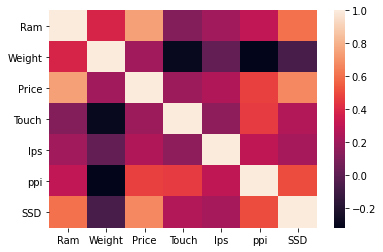
    


```python
sns.displot(df['Price'],kde=True)
```


    <seaborn.axisgrid.FacetGrid at 0x1fba8252910>


    

    


```python
sns.displot(np.log(df['Price']),kde=True) # we can remove skewness of data by taking log
```


    <seaborn.axisgrid.FacetGrid at 0x1fba84259d0>


    
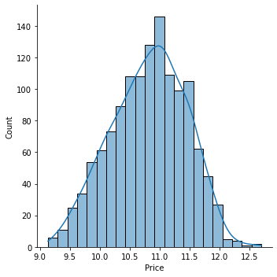
    


># ***Model Selection***


```python
X = df.drop(columns=['Price'])
y = np.log(df['Price'])
```


```python
from sklearn.model_selection import train_test_split
X_train,X_test,y_train,y_test = train_test_split(X,y,test_size=0.15)
```


```python
from sklearn.compose import ColumnTransformer
from sklearn.pipeline import Pipeline
from sklearn.preprocessing import OneHotEncoder
from sklearn.metrics import r2_score,mean_absolute_error
```


```python
from sklearn.linear_model import LinearRegression
from sklearn.neighbors import KNeighborsRegressor
from sklearn.tree import DecisionTreeRegressor
from sklearn.ensemble import RandomForestRegressor
from sklearn.svm import SVR
from xgboost import XGBRegressor
```


```python
X_train
```


<div>
<style scoped>
    .dataframe tbody tr th:only-of-type {
        vertical-align: middle;
    }

    .dataframe tbody tr th {
        vertical-align: top;
    }

    .dataframe thead th {
        text-align: right;
    }
</style>
<table border="1" class="dataframe">
  <thead>
    <tr style="text-align: right;">
      <th></th>
      <th>Company</th>
      <th>TypeName</th>
      <th>Cpu</th>
      <th>Ram</th>
      <th>Gpu</th>
      <th>OpSys</th>
      <th>Weight</th>
      <th>Touch</th>
      <th>Ips</th>
      <th>ppi</th>
      <th>SSD</th>
    </tr>
  </thead>
  <tbody>
    <tr>
      <th>1253</th>
      <td>Lenovo</td>
      <td>Notebook</td>
      <td>Intel Core i5</td>
      <td>8.0</td>
      <td>Intel</td>
      <td>Windows</td>
      <td>1.90</td>
      <td>0</td>
      <td>1</td>
      <td>157.350512</td>
      <td>256</td>
    </tr>
    <tr>
      <th>846</th>
      <td>HP</td>
      <td>2 in 1 Convertible</td>
      <td>Old Intel Processor</td>
      <td>4.0</td>
      <td>Intel</td>
      <td>Others</td>
      <td>1.40</td>
      <td>1</td>
      <td>0</td>
      <td>135.094211</td>
      <td>0</td>
    </tr>
    <tr>
      <th>828</th>
      <td>Acer</td>
      <td>Netbook</td>
      <td>Old Intel Processor</td>
      <td>4.0</td>
      <td>Intel</td>
      <td>Others</td>
      <td>1.35</td>
      <td>0</td>
      <td>1</td>
      <td>135.094211</td>
      <td>0</td>
    </tr>
    <tr>
      <th>1193</th>
      <td>Apple</td>
      <td>Ultrabook</td>
      <td>Old Intel Processor</td>
      <td>8.0</td>
      <td>Intel</td>
      <td>Mac</td>
      <td>0.92</td>
      <td>0</td>
      <td>1</td>
      <td>226.415547</td>
      <td>0</td>
    </tr>
    <tr>
      <th>987</th>
      <td>Lenovo</td>
      <td>Gaming</td>
      <td>Intel Core i7</td>
      <td>8.0</td>
      <td>Nvidia</td>
      <td>Windows</td>
      <td>2.50</td>
      <td>0</td>
      <td>1</td>
      <td>141.211998</td>
      <td>128</td>
    </tr>
    <tr>
      <th>...</th>
      <td>...</td>
      <td>...</td>
      <td>...</td>
      <td>...</td>
      <td>...</td>
      <td>...</td>
      <td>...</td>
      <td>...</td>
      <td>...</td>
      <td>...</td>
      <td>...</td>
    </tr>
    <tr>
      <th>68</th>
      <td>Lenovo</td>
      <td>Notebook</td>
      <td>Intel Core i5</td>
      <td>4.0</td>
      <td>Intel</td>
      <td>Windows</td>
      <td>1.90</td>
      <td>0</td>
      <td>0</td>
      <td>141.211998</td>
      <td>0</td>
    </tr>
    <tr>
      <th>2</th>
      <td>HP</td>
      <td>Notebook</td>
      <td>Intel Core i5</td>
      <td>8.0</td>
      <td>Intel</td>
      <td>Others</td>
      <td>1.86</td>
      <td>0</td>
      <td>0</td>
      <td>141.211998</td>
      <td>256</td>
    </tr>
    <tr>
      <th>1102</th>
      <td>Acer</td>
      <td>Notebook</td>
      <td>Old Intel Processor</td>
      <td>4.0</td>
      <td>Intel</td>
      <td>Others</td>
      <td>2.20</td>
      <td>0</td>
      <td>0</td>
      <td>100.454670</td>
      <td>16</td>
    </tr>
    <tr>
      <th>681</th>
      <td>Asus</td>
      <td>Notebook</td>
      <td>Old Intel Processor</td>
      <td>4.0</td>
      <td>Intel</td>
      <td>Windows</td>
      <td>1.86</td>
      <td>0</td>
      <td>0</td>
      <td>100.454670</td>
      <td>128</td>
    </tr>
    <tr>
      <th>237</th>
      <td>Asus</td>
      <td>Notebook</td>
      <td>AMD Processor</td>
      <td>4.0</td>
      <td>AMD</td>
      <td>Windows</td>
      <td>2.20</td>
      <td>0</td>
      <td>0</td>
      <td>141.211998</td>
      <td>128</td>
    </tr>
  </tbody>
</table>
<p>1106 rows × 11 columns</p>
</div>


>## ***Linear Regression***


```python
step1 = ColumnTransformer(transformers=[
    ('col_tnf',OneHotEncoder(sparse=False,drop='first'),[0,1,2,4,5])
],remainder='passthrough')

step2 = LinearRegression()

pipe = Pipeline([
    ('step1',step1),
    ('step2',step2)
])

pipe.fit(X_train,y_train)

y_pred = pipe.predict(X_test)

print('R2 score',r2_score(y_test,y_pred))
print('MAE',mean_absolute_error(y_test,y_pred))
```

    R2 score 0.859318411697158
    MAE 0.19573779129961213
    

>## ***KNN***


```python
step1 = ColumnTransformer(transformers=[
    ('col_tnf',OneHotEncoder(sparse=False,drop='first'),[0,1,2,4,5])
],remainder='passthrough')

step2 = KNeighborsRegressor(n_neighbors=3)

pipe = Pipeline([
    ('step1',step1),
    ('step2',step2)
])

pipe.fit(X_train,y_train)

y_pred = pipe.predict(X_test)

print('R2 score',r2_score(y_test,y_pred))
print('MAE',mean_absolute_error(y_test,y_pred))
```

    R2 score 0.8077391208820845
    MAE 0.21768615663593668
    

>## ***Decision Tree***


```python
step1 = ColumnTransformer(transformers=[
    ('col_tnf',OneHotEncoder(sparse=False,drop='first'),[0,1,2,4,5])
],remainder='passthrough')

step2 = DecisionTreeRegressor(max_depth=8)

pipe = Pipeline([
    ('step1',step1),
    ('step2',step2)
])

pipe.fit(X_train,y_train)

y_pred = pipe.predict(X_test)

print('R2 score',r2_score(y_test,y_pred))
print('MAE',mean_absolute_error(y_test,y_pred))
```

    R2 score 0.8305373051089887
    MAE 0.20420681720063685
    

>## ***SVM***


```python
step1 = ColumnTransformer(transformers=[
    ('col_tnf',OneHotEncoder(sparse=False,drop='first'),[0,1,2,4,5])
],remainder='passthrough')

step2 = SVR(kernel='rbf',C=10000,epsilon=0.1)

pipe = Pipeline([
    ('step1',step1),
    ('step2',step2)
])

pipe.fit(X_train,y_train)

y_pred = pipe.predict(X_test)

print('R2 score',r2_score(y_test,y_pred))
print('MAE',mean_absolute_error(y_test,y_pred))
```

    R2 score 0.8788081629412049
    MAE 0.17805332860845768
    

## Random Forest


```python
step1 = ColumnTransformer(transformers=[
    ('col_tnf',OneHotEncoder(sparse=False,drop='first'),[0,1,2,4,5])
],remainder='passthrough')

step2 = RandomForestRegressor(n_estimators=100,
                              random_state=3,
                              max_samples=0.5,
                              max_features=0.75,
                              max_depth=15)

pipe = Pipeline([
    ('step1',step1),
    ('step2',step2)
])

pipe.fit(X_train,y_train)

y_pred = pipe.predict(X_test)

print('R2 score',r2_score(y_test,y_pred))
print('MAE',mean_absolute_error(y_test,y_pred))
```

    R2 score 0.8905725472325537
    MAE 0.16381876819826313
    

## XgBoost


```python
step1 = ColumnTransformer(transformers=[
    ('col_tnf',OneHotEncoder(sparse=False,drop='first'),[0,1,2,4,5])
],remainder='passthrough')

step2 = XGBRegressor(n_estimators=45,max_depth=5,learning_rate=0.5)

pipe = Pipeline([
    ('step1',step1),
    ('step2',step2)
])

pipe.fit(X_train,y_train)

y_pred = pipe.predict(X_test)

print('R2 score',r2_score(y_test,y_pred))
print('MAE',mean_absolute_error(y_test,y_pred))
```

    R2 score 0.8833385194439152
    MAE 0.16512528598147824
    

## Exporting the model


```python
import pickle

pickle.dump(df,open('df.pkl','wb'))
pickle.dump(pipe,open('pipe.pkl','wb')) # we are getting the best result in random forest so we will use it's pipe
```


```python

```
